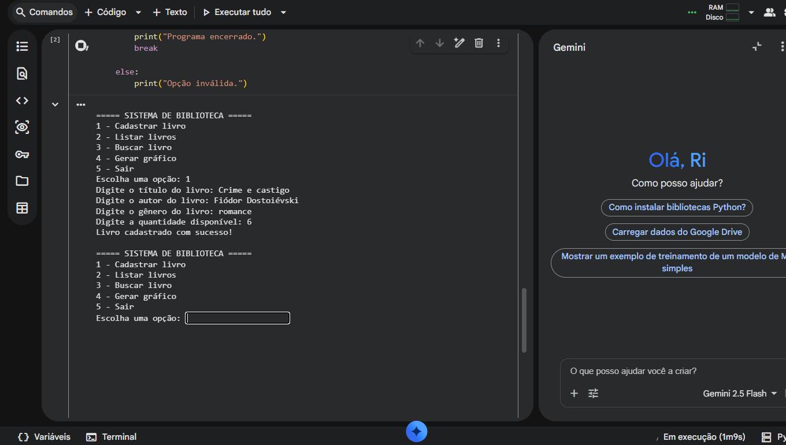
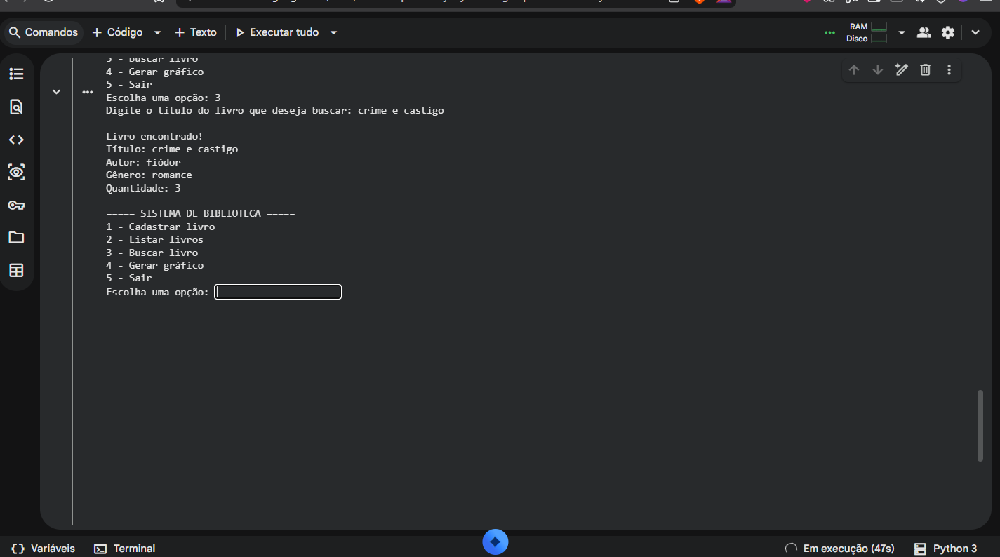
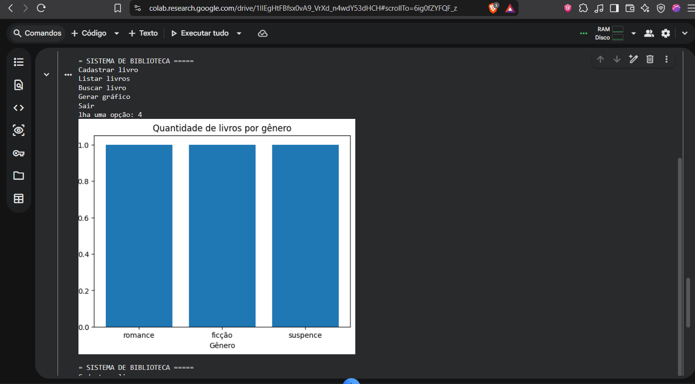

# Sistema de Biblioteca em Python

## Sobre o projeto

Projeto desenvolvido em Python para simular um sistema simples de gerenciamento de livros.

O programa permite cadastrar livros, listar os livros cadastrados, realizar buscas por título e gerar um gráfico com a quantidade de livros por gênero.

O projeto foi desenvolvido originalmente como uma atividade acadêmica da disciplina **Linguagem de Programação** e posteriormente organizado para apresentação como parte do meu portfólio.

## Objetivo

Praticar conceitos fundamentais de programação em Python, incluindo:

- Classes e objetos;
- Funções;
- Listas;
- Dicionários;
- Estruturas condicionais;
- Laços de repetição;
- Entrada e saída de dados;
- Utilização de bibliotecas externas;
- Geração de gráficos.

## Tecnologias utilizadas

- Python
- Matplotlib

## Funcionalidades

O sistema possui as seguintes funcionalidades:

1. Cadastrar livro;
2. Listar livros cadastrados;
3. Buscar livro pelo título;
4. Gerar gráfico com a quantidade de livros por gênero;
5. Encerrar o programa.

## Como funciona

Cada livro cadastrado é representado por um objeto da classe `Livro`, contendo:

- Título;
- Autor;
- Gênero;
- Quantidade disponível.

Os objetos são armazenados em uma lista enquanto o programa está em execução.

A busca percorre os livros cadastrados e compara o título informado pelo usuário.

Para gerar o gráfico, o programa utiliza um dicionário para contar quantos livros foram cadastrados em cada gênero e utiliza o Matplotlib para apresentar os dados visualmente.

## Estrutura do código

### Classe `Livro`

Responsável por representar cada livro cadastrado no sistema.

### `cadastrar_livro()`

Recebe os dados informados pelo usuário, cria um objeto `Livro` e adiciona esse objeto à lista de livros.

### `listar_livros()`

Percorre a lista e apresenta os dados dos livros cadastrados.

### `buscar_livro()`

Procura um livro pelo título informado pelo usuário.

### `gerar_grafico()`

Organiza os gêneros dos livros cadastrados e utiliza o Matplotlib para gerar um gráfico de barras.

### Menu principal

Controla a interação do usuário com o sistema e direciona cada opção para sua respectiva função.

## Evidências

### Cadastro e listagem

### Busca de livro

### Gráfico por gênero

## O que aprendi

Com este projeto, pratiquei a utilização de classes e objetos em Python, organização do código em funções e manipulação de listas e dicionários.

Também tive contato com a utilização de uma biblioteca externa, o Matplotlib, para transformar dados armazenados pelo programa em uma representação gráfica.

Além da implementação, o projeto ajudou a praticar a organização da lógica de um programa por meio de um menu e diferentes funções responsáveis por cada tarefa.

## Possíveis melhorias

Algumas melhorias poderiam ser implementadas em versões futuras, como:

- Permitir editar livros cadastrados;
- Permitir excluir livros;
- Armazenar os dados em um arquivo ou banco de dados;
- Melhorar a validação dos dados de entrada;
- Permitir buscas por autor ou gênero;
- Criar uma interface gráfica.

## Contexto acadêmico

Este projeto foi desenvolvido originalmente como atividade prática da disciplina **Linguagem de Programação**.

A versão apresentada neste repositório foi organizada para documentar o aprendizado e demonstrar a aplicação prática dos conceitos estudados.
